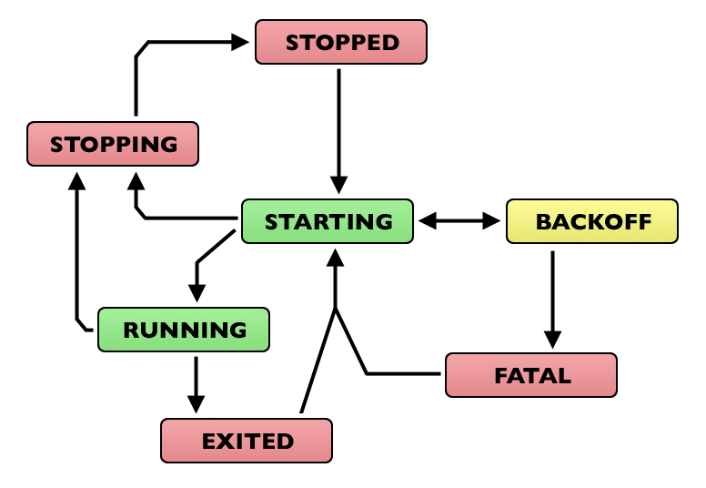

Subprocesses
============

:program:`supervisord`'s primary purpose is to create and manage
processes based on data in its configuration file.  It does this by
creating subprocesses.  Each subprocess spawned by supervisor is
managed for the entirety of its lifetime by supervisord
(:program:`supervisord` is the parent process of each process it
creates).  When a child dies, supervisor is notified of its death via
the ``SIGCHLD`` signal, and it performs the appropriate operation.

.. _nondaemonizing_of_subprocesses:

Nondaemonizing of Subprocesses
------------------------------

Programs meant to be run under supervisor should not daemonize
themselves.  Instead, they should run in the foreground.  They should
not detach from the terminal from which they are started.

The easiest way to tell if a program will run in the foreground is to
run the command that invokes the program from a shell prompt.  If it
gives you control of the terminal back, but continues running, it's
daemonizing itself and that will almost certainly be the wrong way to
run it under supervisor.  You want to run a command that essentially
requires you to press :kbd:`Ctrl-C` to get control of the terminal
back.  If it gives you a shell prompt back after running it without
needing to press :kbd:`Ctrl-C`, it's not useful under supervisor.  All
programs have options to be run in the foreground but there's no
"standard way" to do it; you'll need to read the documentation for
each program.

Below are configuration file examples that are known to start
common programs in "foreground" mode under Supervisor.

Examples of Program Configurations
~~~~~~~~~~~~~~~~~~~~~~~~~~~~~~~~~~

Here are some "real world" program configuration examples:

Apache 2.2.6
++++++++++++

.. code-block:: ini

   [program:apache2]
   command=/path/to/httpd -c "ErrorLog /dev/stdout" -DFOREGROUND
   redirect_stderr=true

Two Zope 2.X instances and one ZEO server
+++++++++++++++++++++++++++++++++++++++++

.. code-block:: ini

   [program:zeo]
   command=/path/to/runzeo
   priority=1

   [program:zope1]
   command=/path/to/instance/home/bin/runzope
   priority=2
   redirect_stderr=true

   [program:zope2]
   command=/path/to/another/instance/home/bin/runzope
   priority=2
   redirect_stderr=true

Postgres 8.X
++++++++++++

.. code-block:: ini

   [program:postgres]
   command=/path/to/postmaster
   ; we use the "fast" shutdown signal SIGINT
   stopsignal=INT
   redirect_stderr=true

OpenLDAP :program:`slapd`
+++++++++++++++++++++++++

.. code-block:: ini

   [program:slapd]
   command=/path/to/slapd -f /path/to/slapd.conf -h ldap://0.0.0.0:8888
   redirect_stderr=true

Other Examples
~~~~~~~~~~~~~~

Other examples of shell scripts that could be used to start services
under :program:`supervisord` can be found at
`http://thedjbway.b0llix.net/services.html
<http://thedjbway.b0llix.net/services.html>`_.  These examples are
actually for :program:`daemontools` but the premise is the same for
supervisor.

Another collection of recipes for starting various programs in the
foreground is available from `http://smarden.org/runit/runscripts.html
<http://smarden.org/runit/runscripts.html>`_.

:program:`pidproxy` Program
---------------------------

Some processes (like :program:`mysqld`) ignore signals sent to the
actual process which is spawned by :program:`supervisord`.  Instead, a
"special" thread/process is created by these kinds of programs which
is responsible for handling signals.  This is problematic because
:program:`supervisord` can only kill a process which it creates
itself.  If a process created by :program:`supervisord` creates its
own child processes, :program:`supervisord` cannot kill them.

Fortunately, these types of programs typically write a "pidfile" which
contains the "special" process' PID, and is meant to be read and used
in order to kill the process.  As a workaround for this case, a
special :program:`pidproxy` program can handle startup of these kinds
of processes.  The :program:`pidproxy` program is a small shim that
starts a process, and upon the receipt of a signal, sends the signal
to the pid provided in a pidfile.  A sample configuration program
entry for a pidproxy-enabled program is provided below.

.. code-block:: ini

   [program:mysql]
   command=/path/to/pidproxy /path/to/pidfile /path/to/mysqld_safe

The :program:`pidproxy` program is put into your configuration's
``$BINDIR`` when supervisor is installed (it is a "console script").

.. _subprocess_environment:

Subprocess Environment
----------------------

Subprocesses will inherit the environment of the shell used to start
the :program:`supervisord` program.  Several environment variables
will be set by :program:`supervisord` itself in the child's
environment also, including :envvar:`SUPERVISOR_ENABLED` (a flag
indicating the process is under supervisor control),
:envvar:`SUPERVISOR_PROCESS_NAME` (the config-file-specified process
name for this process) and :envvar:`SUPERVISOR_GROUP_NAME` (the
config-file-specified process group name for the child process).

These environment variables may be overridden within the
``[supervisord]`` section config option named ``environment`` (applies
to all subprocesses) or within the per- ``[program:x]`` section
``environment`` config option (applies only to the subprocess
specified within the ``[program:x]`` section).  These "environment"
settings are additive.  In other words, each subprocess' environment
will consist of:

  The environment variables set within the shell used to start
  supervisord...

  ... added-to/overridden-by ...

  ... the environment variables set within the "environment" global
      config option ...

   ... added-to/overridden-by ...

   ... supervisor-specific environment variables
       (:envvar:`SUPERVISOR_ENABLED`,
       :envvar:`SUPERVISOR_PROCESS_NAME`,
       :envvar:`SUPERVISOR_GROUP_NAME`) ..

   ... added-to/overridden-by ...

   ... the environment variables set within the per-process
       "environment" config option.

No shell is executed by :program:`supervisord` when it runs a
subprocess, so environment variables such as :envvar:`USER`,
:envvar:`PATH`, :envvar:`HOME`, :envvar:`SHELL`, :envvar:`LOGNAME`,
etc. are not changed from their defaults or otherwise reassigned.
This is particularly important to note when you are running a program
from a :program:`supervisord` run as root with a ``user=`` stanza in
the configuration.  Unlike :program:`cron`, :program:`supervisord`
does not attempt to divine and override "fundamental" environment
variables like :envvar:`USER`, :envvar:`PATH`, :envvar:`HOME`, and
:envvar:`LOGNAME` when it performs a setuid to the user defined within
the ``user=`` program config option.  If you need to set environment
variables for a particular program that might otherwise be set by a
shell invocation for a particular user, you must do it explicitly
within the ``environment=`` program config option.  An
example of setting these environment variables is as below.

.. code-block:: ini

   [program:apache2]
   command=/home/chrism/bin/httpd -c "ErrorLog /dev/stdout" -DFOREGROUND
   user=chrism
   environment=HOME="/home/chrism",USER="chrism"

.. _process_states:

Process States
--------------

A process controlled by supervisord will be in one of the below states
at any given time.  You may see these state names in various user
interface elements in clients.

``STOPPED`` (0)

  The process has been stopped due to a stop request or
  has never been started.

``STARTING`` (10)

  The process is starting due to a start request.

``RUNNING`` (20)

  The process is running.

``BACKOFF`` (30)

  The process entered the ``STARTING`` state but subsequently exited
  too quickly to move to the ``RUNNING`` state.

``STOPPING`` (40)

  The process is stopping due to a stop request.

``EXITED`` (100)

  The process exited from the ``RUNNING`` state (expectedly or
  unexpectedly).

``FATAL`` (200)

  The process could not be started successfully.

``UNKNOWN`` (1000)

  The process is in an unknown state (:program:`supervisord`
  programming error).

Each process run under supervisor progresses through these states as
per the following directed graph.

   Subprocess State Transition Graph

A process is in the ``STOPPED`` state if it has been stopped
adminstratively or if it has never been started.

When an autorestarting process is in the ``BACKOFF`` state, it will be
automatically restarted by :program:`supervisord`.  It will switch
between ``STARTING`` and ``BACKOFF`` states until it becomes evident
that it cannot be started because the number of ``startretries`` has
exceeded the maximum, at which point it will transition to the
``FATAL`` state.  Each start retry will take progressively
more time.

When a process is in the ``EXITED`` state, it will
automatically restart:

- never if its ``autorestart`` parameter is set to ``false``.

- unconditionally if its ``autorestart`` parameter is set to ``true``.

- conditionally if its ``autorestart`` parameter is set to
  ``unexpected``.  If it exited with an exit code that doesn't match
  one of the exit codes defined in the ``exitcodes`` configuration
  parameter for the process, it will be restarted.

A process automatically transitions from ``EXITED`` to ``RUNNING`` as
a result of being configured to autorestart conditionally or
unconditionally.  The number of transitions between ``RUNNING`` and
``EXITED`` is not limited in any way: it is possible to create a
configuration that endlessly restarts an exited process.  This is a
feature, not a bug.

An autorestarted process will never be automatically restarted if it
ends up in the ``FATAL`` state (it must be manually restarted from
this state).

A process transitions into the ``STOPPING`` state via an
administrative stop request, and will then end up in the
``STOPPED`` state.

A process that cannot be stopped successfully will stay in the
``STOPPING`` state forever.  This situation should never be reached
during normal operations as it implies that the process did not
respond to a final ``SIGKILL`` signal sent to it by supervisor, which
is "impossible" under UNIX.

State transitions which always require user action to invoke are
these:

``FATAL``   -> ``STARTING``

``RUNNING`` -> ``STOPPING``

State transitions which typically, but not always, require user
action to invoke are these, with exceptions noted:

``STOPPED`` -> ``STARTING`` (except at supervisord startup if process
is configured to autostart)

``EXITED`` -> ``STARTING`` (except if process is configured to
autorestart)

All other state transitions are managed by supervisord automatically.
